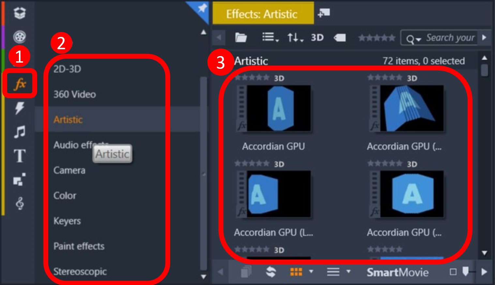
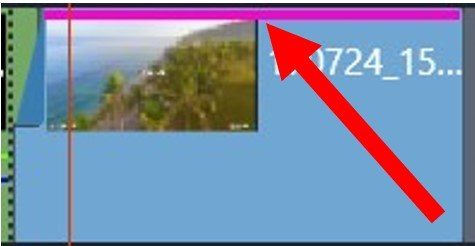
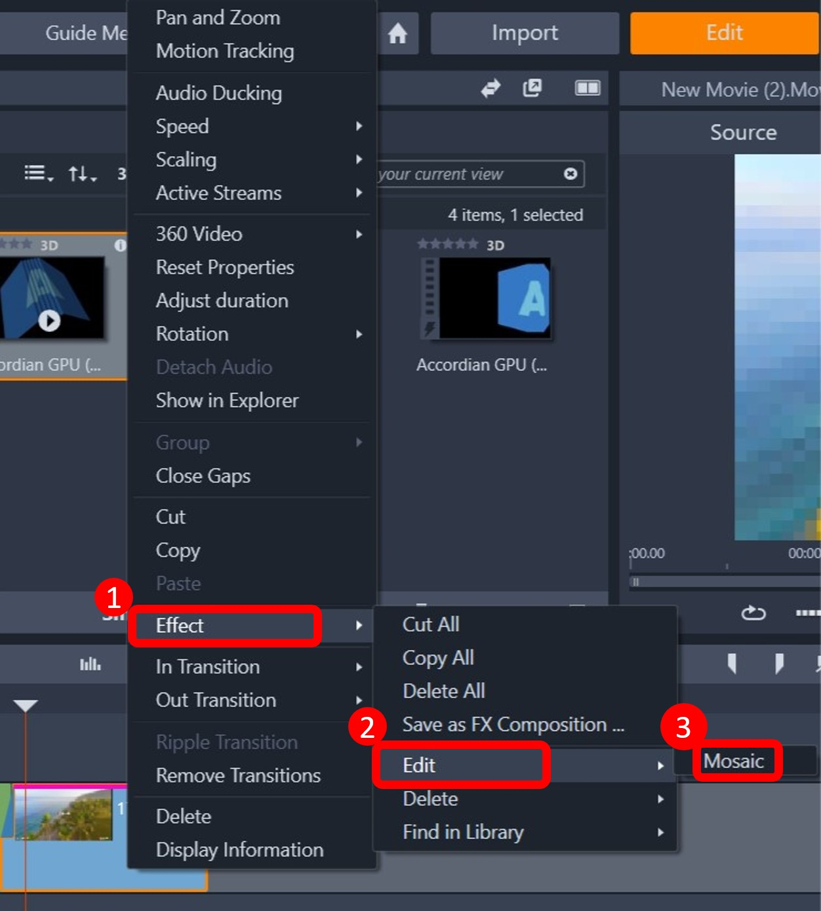

# Task Three: Add Effects

Pinnacle Studio provides a suite of customizable built in effects. Adding effects to your video 
will prevent awkward transitions between video clips and also enhance dull looking video clips.

This section will go over the basics of adding, editing, and deleting video transitions and video effects.

## Table of Contents
{: .no_toc .text-delta }

3. TOC
{:toc}

---

## Task 3.1 Add Transitional Effects

1\. **Add** two videos you want to transition between side by side in the timeline view. 

2\. Find the transition effect you want by **clicking** the thunderbolt icon  in the library pane.

 
 
3\. **Drag and drop** the effect on top of the video clip in the timeline. \

 **Note:** If the effect is an entrance effect, it will apply to the beginning of the video. If 
it is an exit effect, it will apply to the end of the video. If the effect is generic, you can choose to apply
it to the first half or second half by dropping the effect on the respective half. 

  
4\. Check that the effect was applied by looking for a box shape at the corner of your video clip. The first (green) half decreasing while the 
second (blue) half increasing means the effect will transition from the first video to the second. \

 **Note:** The effect is applied to both video clips, but Pinnacle Studio will display 
it on the clip that will be cut a bit short to include the transition.

5\. Edit the duration of the effect by **right-clicking** the effect box and selecting [Transition] > [Edit]. Enter
The duration of the effect and click [OK] to confirm and return.

## Task 3.2 Add Video Effects
1\. **Drag  and drop** the video you want to apply an effect to the timeline.

2\. Find the transition effect you want by **clicking** the fx icon  in the library pane.

3\. **Drag and drop** the effect on top fo the video clip in the timeline.

4\. There will be a pink line on video clips with effects. \
 

## Task 3.3 Edit an Effect

1\. **Right-click** on the video clip in the timeline to bring up a contextual menu. \

2\. **Select** [Effect]>[Edit]>[your effect]

3\. (Optional) Make any changes to your effect in the edit effect window.
<ul> 
<li> Select a different using the top bar labeled "Effect Selector". </li>
<li> Make any changes to your effect using the side bar on the right labeled "Effect Properties". </li>
<li> Preview your effect in the bottom bar labeled "Effect Preview". </li>
</ul>

4\. **Click** [OK] to confirm and return.
## Task 3.4 Delete Effect

1\. **Right-click** on the effects box to bring up a contextual menu. \

 **Warning: Be sure to only delete the effect. If you right click in the video box, you will 
delete the video along with the effects.** \

2\. **Click** [Transition]>[Delete] to delete an effect.
 \

