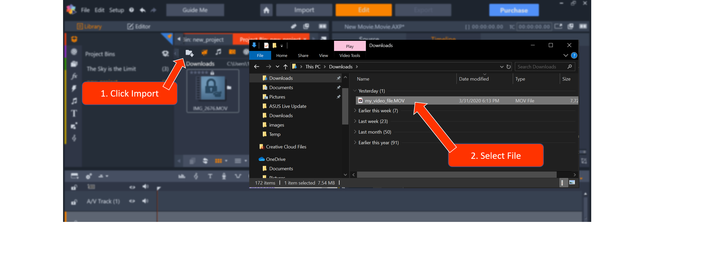
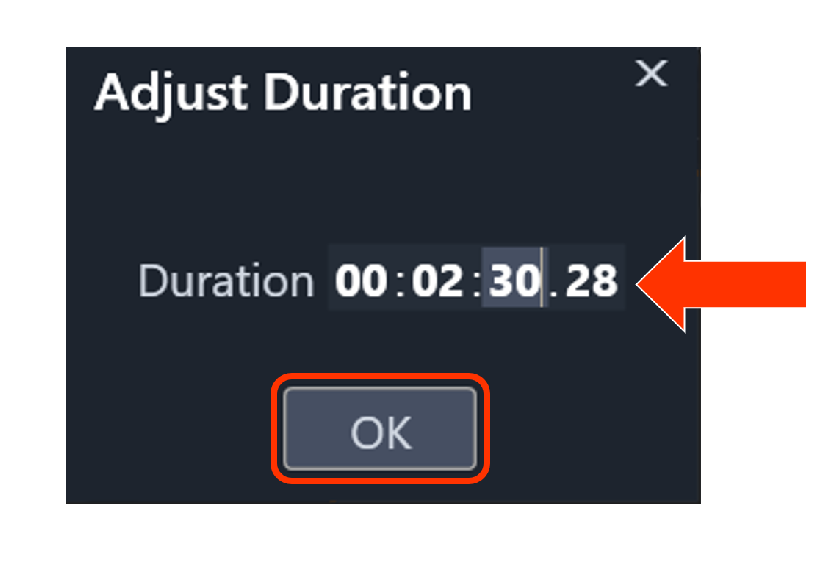
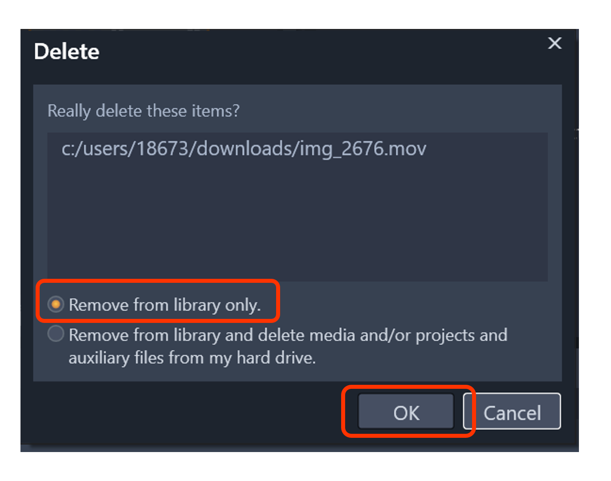
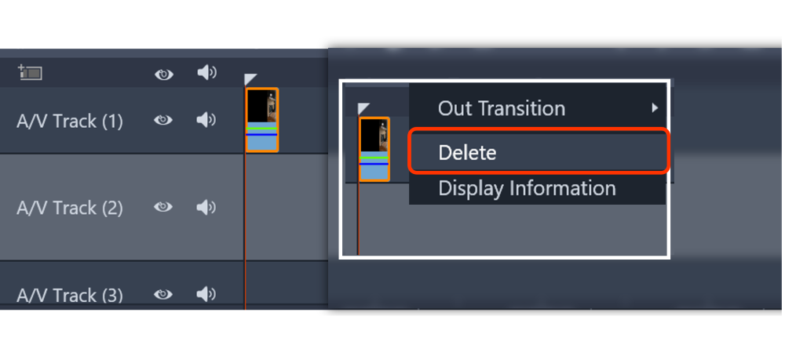

# Task One: Create A Video 
{: .no_toc } 
In this section you will be able to create your first movie by using the different features in Pinnacle. Your movie will 
be made up of imported, edited, and enhanced audio and visual files. At the end, you can export your movie. This section will guide you through the importing, editing and exporting basics. 

## Table of contents
{: .no_toc .text-delta }

1. TOC
{:toc}

---
## Introduction 

## Task 1.1 Create A Movie

1.  Open Pinnacle and select [File] > [New] > [Movie].  
This will guide you to the main page where you can visualize your new movie. If you are unfamiliar
with the Pinnacle Studio layout and conventions, review them [here.](/index.md) 

2.  Create a new project bin by selecting the  icon.  
This project bin will help organize your files. 

3.  Type the name for your new project and click [Okay].  
This project is now ready to import the video and audio you want to use for your movie. 

4.  To import your media select the  icon and search for the files you'd like to use.   
  
   
5.	Now your files are ready to use drag your video to the first A/V Track at the beginning of the track.  
    

## Task 1.2 Editing Your Files 

There are **two** ways to trim a audio or video file once it has been placed on the track. 

---

### Adjust Duration
{: .text-gamma }

1. To adjust the duration of a audio/video clip, simply right click the media on the track to reveal an options menu. 

2. Click [Duration].

3. Adjust to desired length and click [Okay].

  
  **Note**: This method will **only** trim your file from the end. 
 
### Trim Front and/or Back

1. To adjust the duration of a clip directly on the track, drag the edges of the clip file directly.

---

## Task 1.3 Delete A File

---
 
### Delete A File From The Project 

1. Right-click the file in the your project bin.  
 
2. Select [Delete selected]  
  
3. Select [Remove from library only.]   
 

 
 **Caution** selecting "Remove from library and delete and/or projects and 
auxiliary files from my hard drive" will remove the file from your your project **and** your computer. Make sure you 
have an external copy of these files if you plan on needing them in the future. 

---
### Delete A File From The Track 

1. Right-click the file you wish to delete on the track.  
 
2. Click delete. 

---

## Task 1.4 Export and Share Your Movie

---
