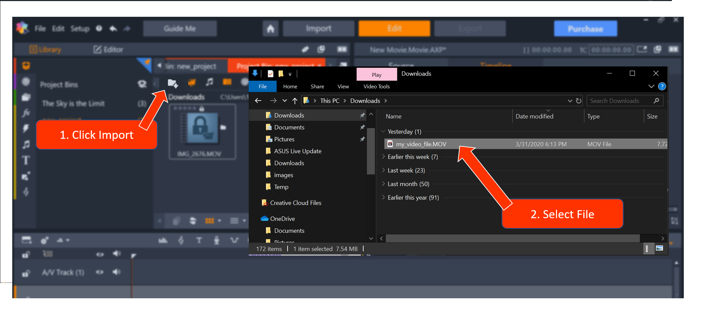

# Task One: Create And Export a Basic Movie 
{: .no_toc } 
Understanding the basics of Pinnacle Studio lays the foundation to utilizing all the tools and effects Pinnacle Studios has to offer.  

In this section we will guide you to create your first movie by using the different features in Pinnacle. Your movie will 
be made up of imported, edited, and enhanced audio and visual files. At the end, you can export your movie.
## Table of contents
{: .no_toc .text-delta }

1. TOC
{:toc}

---
## Introduction 

## Task 1.1 Create A Movie

1.  **Open** Pinnacle and **select** [File] > [New] > [Movie].  
This will guide you to the main page where you can visualize your new movie. If you are unfamiliar
with the Pinnacle Studio layout and conventions, review them [here.](Glossary.md) 

2.  Create a new project bin by **clicking** the  icon.  
This project bin will help organize your files. 

3.  **Type** the name for your new project in the *File Name* box and click [OK].  
This project is now ready to import the video and audio you want to use for your movie. 

4.  **Click** the  icon and search for the files you'd like to import and use.   
  
   
5.	**Drag** your video to the first A/V Track at the beginning of the track.  
    

## Task 1.2 Editing Your Files 

There are **two** ways to trim an audio or video file once it has been placed on the track. 

---

### Adjust Duration
{: .text-gamma }

1. **Right-click** your media file on the track to reveal a contextual menu. 

2. **Click** [Duration] to open the *Adjust Duration* window.

3. **Adjust** to desired length by typing and **click** [OK].

 **Note**: This method will **only** trim the end of file. 
 
### Trim Front and/or Back

1. **Hover** your mouse on either the front (trim beginning of file) or tail (trim end of file) end of the file until you see 
a white arrow and/or drag prompt.

2. **Drag** to the new desired length of the file. 
  

---

## Task 1.3 Delete A File

---
 
### Delete A File From The Project 

1. **Right-click** the file in your project bin.  
 
2. **Select** [Delete selected].  
  
3. **Select** [Remove from library only].   
 

 
 **Caution:  Selecting [Remove from library and delete and/or projects and 
auxiliary files from my hard drive] will remove the file from your your project *and* your computer. Make sure you 
have an external copy of these files if you plan on needing them in the future.** 

---
### Delete A File From The Track 

1. **Right-click** the file you wish to delete on the track.  
 
2. **Click** [delete]. 

---

## Task 1.4 Export and Share Your Movie

1. **Click** the [Export] on the top of your window to navigate to the Export page. 

2. **Name** your movie in "File Name" window.  

3. **Select** [Add Exported File to Library] from the "After Export Actions" menu. 

4. **Select** [H.264/AVC] from the drop down menu to the right of "Format".  
H.264/ACV will export you film to a mp4 file. This format is one of the most universal video formats. 

5. **Click** [Export]. 

6. Wait for your video to export.  
A progress bar will appear at the bottom of the video preview bar.   

7. When Pinnacle Studio has exported your new movie, it will automatically open your file explorer where your movie is located. 

8. Now time to grab some popcorn and enjoy your new film! Don't forget the extra butter. 

---
