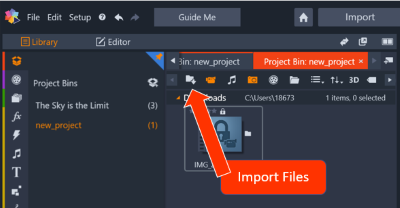

# Task One: Create A Video 
{: .no_toc } 
In this section you will be able to create your first movie by using the different features in Pinnacle. Your movie will 
be made up of imported, edited, and enhanced audio and visual files. At the end, you can export your movie. This section will guide you through the importing, editing and exporting basics. 

## Table of contents
{: .no_toc .text-delta }

1. TOC
{:toc}

---
## Introduction 

## Task 1.1 Create A Movie

1.  Open Pinnacle and select [File] > [New] > [Movie].  
This will guide you to the main page where you can visualize your new movie. If you are unfamiliar
with the Pinnacle Studio layout and conventions, review them [here.](/index.md) 

2.  Create a new project bin by selecting the  icon.  
This project bin will help organize your files. 

3.  Type the name for your new project and click [Okay].  
This project is now ready to import the video and audio you want to use for your movie. 

4.  To import your media select the “Quick Import” icon.  



5.	Now your files are ready to use, drag your video to the first A/V Track at the beginning of the track.  
    

## Task 1.2 Editing Your Files 

There are **two** ways to trim a audio or video file once it has been placed on the track. 

#### Example
{: .no_toc }

```yaml
---
layout: default
title: UI Components
nav_order: 2
has_children: true
---
```

### Menu Adjust
{: .text-gamma }
1. To adjust the duration of a audio/video clip, simply right click the media on the track to reveal an options menu. 

2. Select [Duration]

3. Adjust to desired length 

#### Example
{: .no_toc }

```yaml
---
layout: default
title: Buttons
parent: UI Components
nav_order: 2
---
```

The Buttons page appears as a child of UI Components and appears second in the UI Components section.

#### Track Adjust 
{: .text-gamma }

1. To adjust the duration of a clip directly on the track, drag the edges of the clip file directly

IMAGE HERE 
#### Example
{: .no_toc }

```yaml
---
layout: default
title: UI Components
nav_order: 2
has_children: true
has_toc: false
---
```
```

## Task 1.3 Delete A File Wow 

1. Deleting 

---

## Task 1.4 Export and Share Your Movie

---
