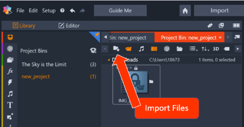

# Task One: Create A Video 
{: .no_toc } 
In this section you will be able to create your first movie by using the different features in Pinnacle. Your movie will 
be made up of imported, edited, and enhanced audio and visual files. This section will guide you through the importing, editing and exporting basics. 

## Table of contents
{: .no_toc .text-delta }

1. TOC
{:toc}

---
## Introduction 

## Task 1.1 Create A Movie

1.  Open Pinnacle and select [File] > [New] > [Movie]. 
This will guide you to the main page where you can visualize your new movie. If you are unfamiliar
with the Pinnacle Studio layout and conventions, review them [here.](Em-Kevin-Pinnacle-Studio\index.md) 

2.  Create a new project bin by selecting the  icon. 
This project bin will help organize your files. 

3.  Type the name for your new project and click [Okay]. 
This project is now ready to import the video and audio you want to use for your movie. 

4.  To import your media select the “Quick Import” icon.  



5.	Now your files are ready to use, drag your video to the first A/V Track at the beginning of the track. PHOTO . 
    

## Task 1.2 Trim A File

There are **two** ways to trim a audio or video file once it has been placed on the track. 

```yaml
---
layout: default
title: Trim A File
nav_order: 2
has_children: true
---
```

Here we're setting up the UI Components landing page that is available at `/docs/ui-components`, which has children and is ordered second in the main nav.

### Menu Adjust
{: .text-gamma }
1. To ajust the duration of a audio/video clip, simply right click the media on the track to reveal an options menu. 

2. Select [Duration]

3. Adjust to desired length 

#### Example
{: .no_toc }

```yaml
---
layout: default
title: Buttons
parent: UI Components
nav_order: 2
---
```

---


#### Track Adjust 
{: .text-gamma }

1. To adjust the duration of a clip directly on the track, drag the edges of the clip file directly

IMAGE HERE 


---
## Task 1.3 Delete A File 

1. Deleting 

---

## Task 1.4 Export and Share Your Movie


---gi tpu

## In-page navigation with Table of Contents

To generate a Table of Contents on your docs pages, you can use the `{:toc}` method from Kramdown, immediately after an `<ol>` in Markdown. This will automatically generate an ordered list of anchor links to various sections of the page based on headings and heading levels. There may be occasions where you're using a heading and you don't want it to show up in the TOC, so to skip a particular heading use the `{: .no_toc }` CSS class.

#### Examplesdfgsdfg sdfg 
{: .no_toc }

```markdown
# Navigation Structure
{: .no_toc }

## Table of contents
{: .no_toc .text-delta }

1. TOC
{:toc}
```

This example skips the page name heading (`#`) from the TOC, as well as the heading for the Table of Contents itself (`##`) because it is redundant, followed by the table of contents itself.
