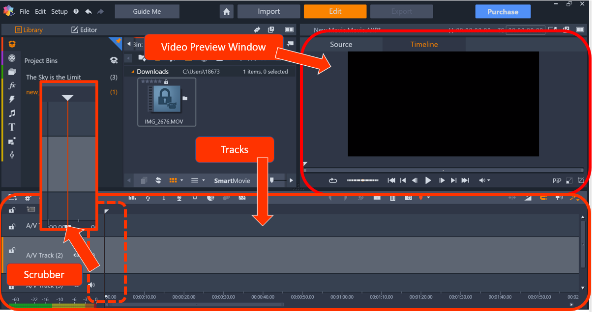

#Glossary
{: .no_toc } 

These instructions incorporate the following Pinnacle Studio Conventions: 

**Scrubber**: The scrubber is the single vertical line that marks where you are in the timeline. You can move the 
scrubber by dragging it across the timeline.  

**Timeline**: The timeline occupies the bottom half of your screen and displays the video/audio clips in chronological order. 

**Track(s)**:  The tracks or timeline tracks are what occupy the timeline. A tracks will hold a single media file 
and this allows you to overlap video and audio files. The trial version of Pinnacle consists of 7 tracks in its timeline. 

**Video Preview Window**: The video preview window is located on the top right hand quadrant of your screen.
It allows you to see your progress without switching to full screen. 

