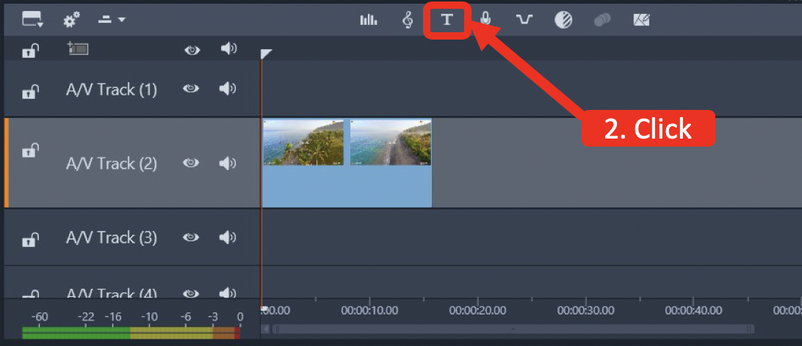
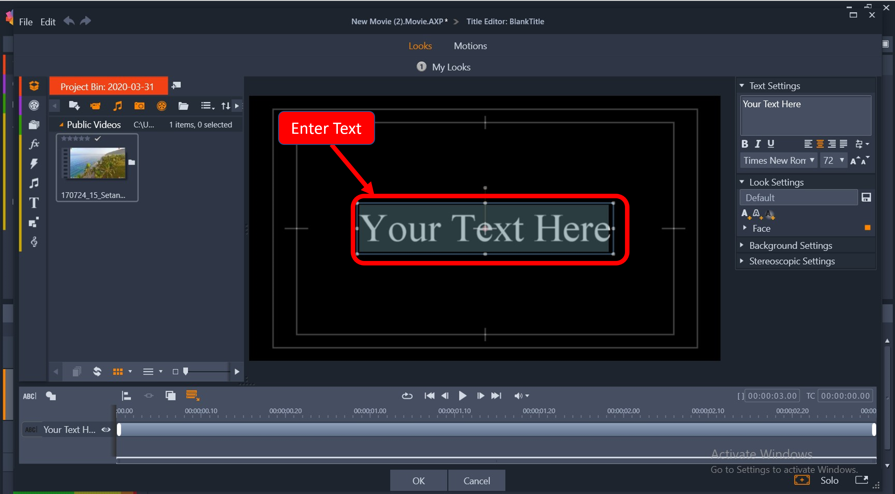
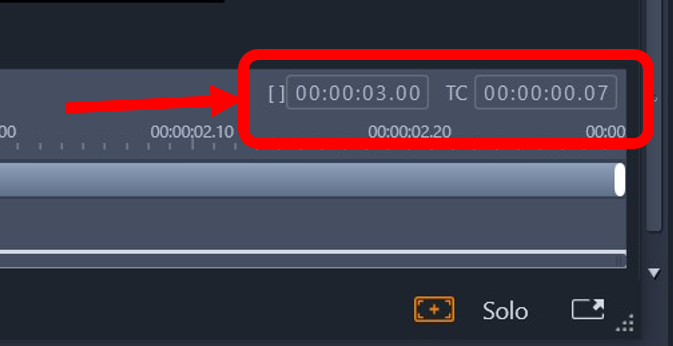
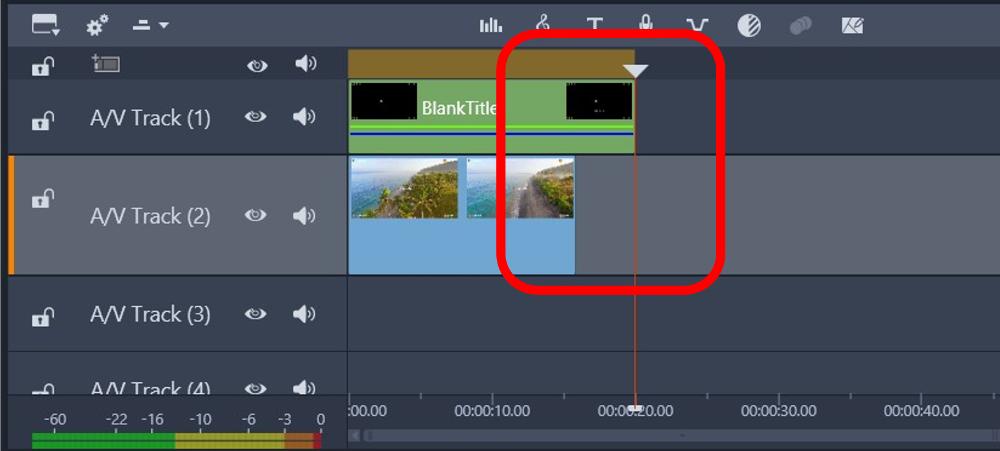
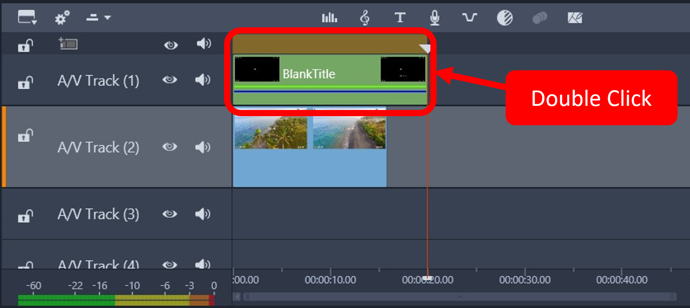
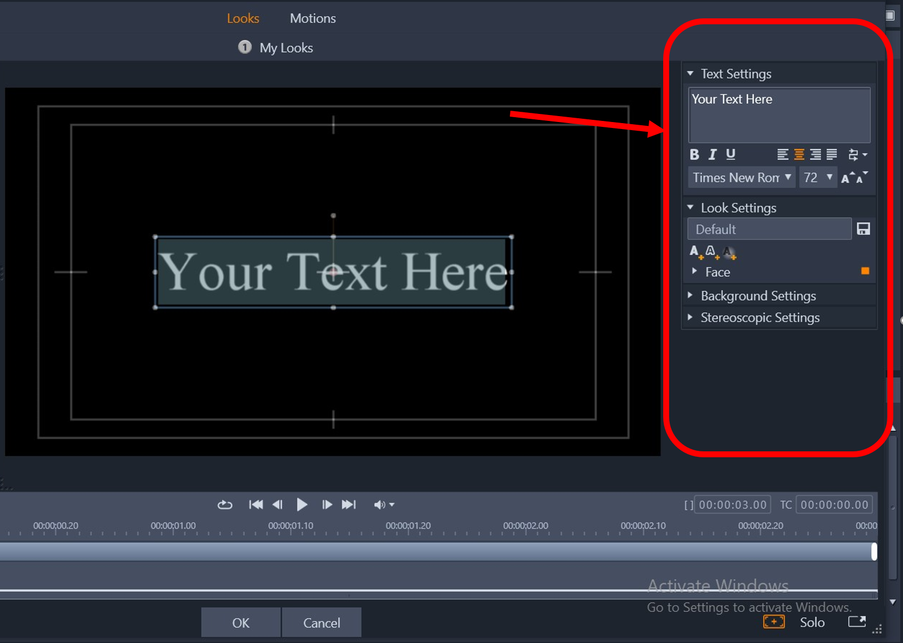
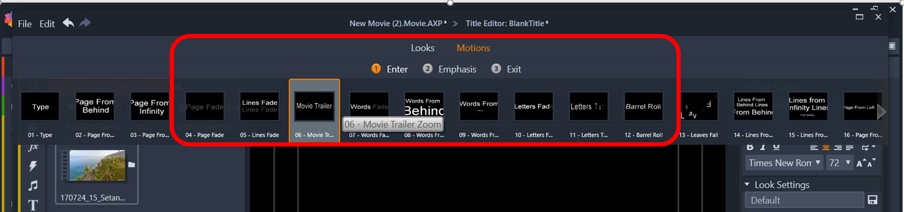
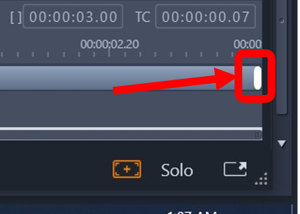

# Task Two: Adding Subtitles to Your Video

Adding subtitles to your video can help you deliver a clearer message to your audience. Pinnacle Studio supports
user customizable fonts and subtitle timing. You are able to customize how the fonts look and even animate the subtitles. 

This section will show you how to add subtitles to your existing videos, edit elements of the subtitle, and set the timing
for your subtitle.

## Table of Contents
{: .no_toc .text-delta }

1. TOC
{:toc}

---

## Task 2.1 Create Subtitle 

1\. **Drag** your video clip from your library to one of the available A/V tracks excluding the first track.

**Caution: Leave the first track for subtitles. Tracks in Pinnacle Studio are like a stack of
 plates. The first track will be "on top" of tracks beneath it.**
 
2\. **Click** the  to open a "Title Editor" window. 

3\. **Add** your text under **Your Text Here**. Position your text to a suitable position on screen 
within the white outer box. 

5\. Adjust the duration of the text by **inputting** when the subtitle will enter and when the subtitle will exit.
[] represents the beginning time. TC is the ending time. 

 **Note**: The time format is HH:MM:SS.SS.

6\. **Click** [OK] to save your text and exit out of the "Title Editor". 

7\. Verify your subtitle's runtime does not run past the video's runtime. 

## Task 2.2 Edit Subtitle 

1\. **Double-click** the subtitle box to edit the current subtitle.

2\. (Optional) **Edit** the looks of your subtitle using the Text Settings options.

3\. (Optional) **Add** a motion (Enter, Emphasis, or Exit) to your subtitle by clicking Motions and the subsequent option.

4\. Adjust the duration of the motion by **moving** the white tab in the text timeline.

5\. **Click** [OK] to save your text and exit out of the "Title Editor". 

## Conclusion
{: .no_toc }
Your subtitles should be in your video. Play your video in the Video Preview Window to see watch your video!