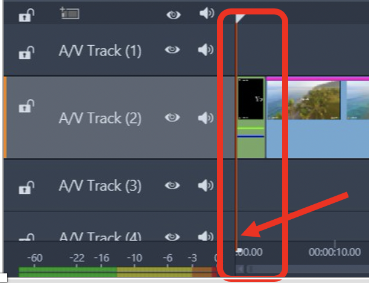
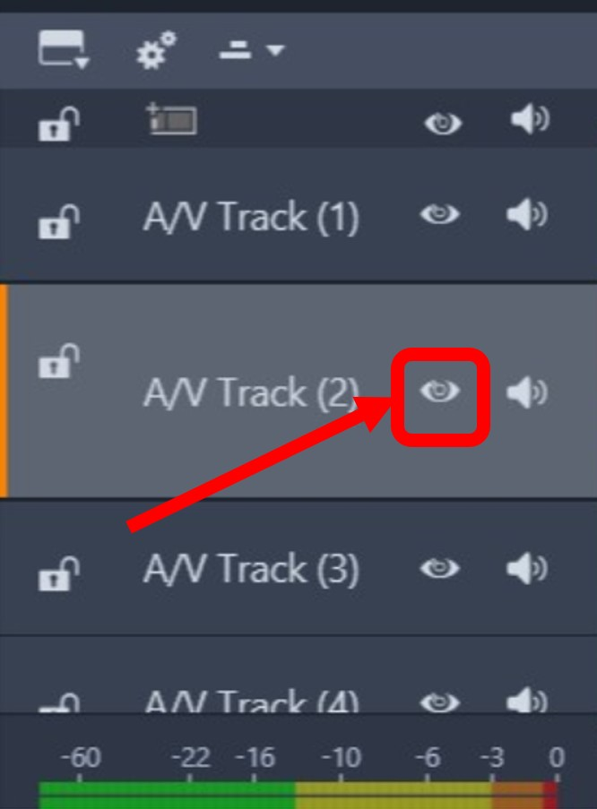

## Table of Contents
{: .no_toc .text-delta }

1. TOC
{:toc}

---

## I am unable to import my video clip.

Check your video clip file format. It has to be one of the compatible format to be imported. Click
<a href="https://shihkster1015.github.io/Em-Kevin-Pinnacle-Studio/#supported-video-files" >here</a> 
for the list of compatible video formats.

## I am unable to play my video clip that was previously working. 

This happens when Pinnacle Studio can no longer locate your file on your computer. This happens if a file is renamed or if it 
has been moved or deleted from your computer. 

## I am unable to launch Pinnacle Studio. 

It is difficult to pinpoint the source of this problem but restarting your computer is a good starting point. 
If this doesn't work ensure you have the latest version of Pinnacle Studio. If neither of these methods work, 
uninstall Pinnacle Studio from your computer by opening Control Panel and selecting the “Programs and Features” list. 
After uninstalling, reinstall Pinnacle Studio and try launching again.   

## I can't play my entire video in the Video Preview Window.

Make sure the Scrubber starts at the beginning of your video clip in the timeline. The Scrubber
has to be at the very left side (beginning) of the timeline. This is also indicated with the Scrubber
at 00:00.00 mark at the bottom of the timeline.

## I can't see my video clip at all.

Check the visibility of your track in the timeline. If your track is hidden, it will have an eye with a red slash 
. 
Click the eye until the red slash disappears . 
Your track should look like this: 
